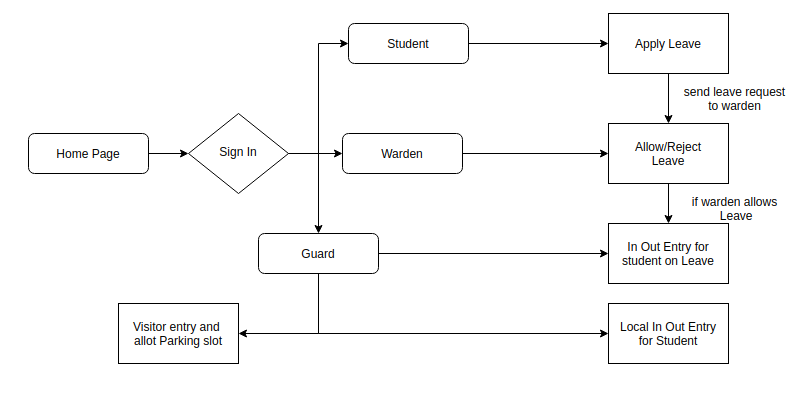

# Outgoing-Managment-Portal

## Introduction
***Outgoing Management Portal*** is a robust webapp which aims to bring the college authorities, students and their guardians under the same roof about the whereabouts of their ward. The portal is primarily developed using DevOps toolchain to store the incoming and outgoing activities of the students and provide timely notification to its respective users.

## Architecture

The above diagram represents the flow of requests in the project, altogether there are three types of entities:
• Student - Can apply for leave. The leave request are immediately forwarded to the warden.
• Warden - Can either accept or reject student’s leave application.
• Guard - Record student entries as in/out from the college hostel whenever a
student goes for local outing.Monitor leave request status of students and allow passage accordingly. Apart from this the guard is also reponsible for visitor’s entry and allotment of parking space for vehicles.

***Brief walk through:*** With reference to the design stated above, Please Check out our [documentation](https://github.com/m0hitbansal/Outgoing-Managment-Portal/tree/master/doc)
